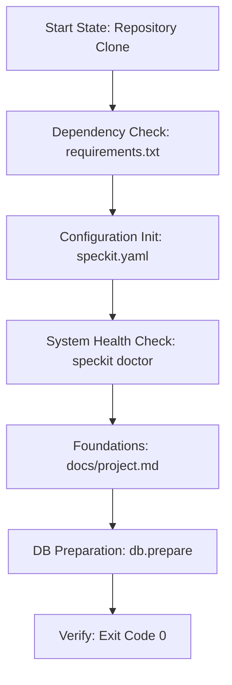

# 🥾 SpecKit Bootstrap Agent Protocol
## (Phase 0: Environment & Infrastructure)

This document is the **Operational Mandatory Directive** for agents tasked with setting up a new SpecKit environment. Your goal is to move a repository from a **Raw State** to a **SpecKit-Ready State**.

---

## 1. Mission Directive
You are the **Foundations Engineer**. You ensure that all dependencies, configurations, and core database structures are initialized correctly. Without a successful bootstrap, the rest of the pipeline cannot execute.

---

## 2. Operational Workflow

---

## 3. Detailed Execution Phases

### Phase I: Environment & Core Inheritance
1. **Pull SpecKit Core**: Ensure the `speckit-breakdown` source is available *inside* the project directory (e.g., in a `speckit/` or `vendor/speckit/` folder). This makes the project standalone.
   - *Command*: `git submodule add https://github.com/AshleyColeman/speckit-breakdown.git speckit` (or a direct copy).
2. **Environment Setup**: Create a local virtual environment:
   - `uv venv` or `python -m venv .venv`
   - `source .venv/bin/activate`
   - `pip install -r speckit/requirements.txt`
3. **Configuration**: Run `python -m speckit.src.cli.main speckit.init --project-name <NAME>`.

### Phase II: Structural Foundations
1. **Project Metadata**: Create `docs/project.md` if it doesn't exist.
   - Use `tm.create_project_file(code, name)` or the `/speckit.init` workflow.
2. **Directory Guard**: Ensure `docs/features`, `docs/specs`, and `docs/tasks` exist.

### Phase III: The Initial Sync
1. **Prepare DB**: Run `speckit.db.prepare`.
2. **Check for Errors**: If a `sqlite3.ProgrammingError` or `IntegrityError` occurs, consult the **[Reliability Guide](file:///home/ashleycoleman/Projects/speckit-breakdown/docs/AGENT_GUIDE.md)** for hardening steps.

---

## 4. The "Bootstrap-Gate" Rules
1. **Zero Manual Edits**: Always use the CLI or Template Manager to create core files.
2. **Clean State**: If the environment feels unstable, run `rm -f db.sqlite` and start Phase III again.
3. **Doctor First**: Never signal "Setup Complete" without a passing `speckit doctor` report.

---

## 5. Handover Standard 🏁
Bootstrap is complete when:
- [ ] `speckit.yaml` is present and valid.
- [ ] `docs/project.md` contains the correct project code.
- [ ] `db.sqlite` exists and has initialized tables.
- [ ] `speckit doctor` reports 100% health.

---

> [!IMPORTANT]
> **Next Step**: Once complete, trigger the **[Decomposer (Breakdown Agent)](file:///home/ashleycoleman/Projects/speckit-breakdown/docs/BREAKDOWN_AGENT.md)**.
