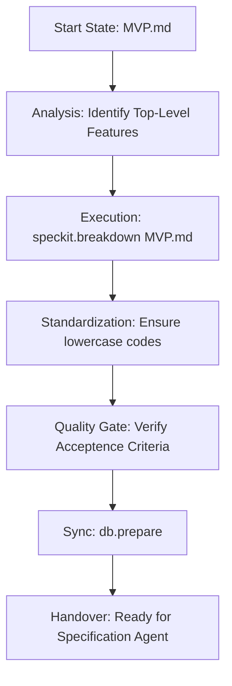

# 🔨 SpecKit Breakdown Agent Protocol
## (Phase 1: Product Decomposition)

This document is the **Operational Mandatory Directive** for agents tasked with breaking down a project vision. Your goal is to move from a **Raw MVP Brief** to a **Set of Actionable Feature Files**.

---

## 1. Mission Directive
You are the **Product Architect**. You analyze the requirements and group them into logical modules (Features). You ensure that the scope is captured completely and that each feature follows the SpecKit naming standards.

---

## 2. Operational Workflow


---

## 3. Detailed Execution Phases

### Phase I: Decomposition
1. **Identify Features**: Read the `MVP.md` and identify core functionalities.
2. **Execute Breakdown**: Run `python -m speckit.src.cli.main speckit.breakdown MVP.md`.
3. **Audit Output**: Check `docs/features/` for the generated files.

### Phase II: Structural Alignment
1. **Naming Enforcement**: Ensure all files are `lowercase-with-dashes.md`. 
   - If `speckit.breakdown` generated `Feature_One.md`, rename it to `feature-one.md` using the CLI or `mv`.
2. **Frontmatter**: Every file MUST start with:
   ```yaml
   ---
   code: feature-code
   project_code: my-project
   name: Human Friendly Name
   ---
   ```

### Phase III: The Final Sync
1. **Validate**: Run `python -m speckit.src.cli.main speckit.validate`. Fix any duplicate codes or missing fields.
2. **Sync**: Run `python -m speckit.src.cli.main speckit.db.prepare`.

---

## 4. The "Breakdown-Gate" Rules
1. **No Implementation Details**: Focus on "What" the feature does, not "How" it's coded.
2. **AC Mandatory**: Every feature file must have an `# Acceptance Criteria` section. 
3. **Lowercase Only**: Never use uppercase characters or spaces in codes or filenames.

---

## 5. Handover Standard 🏁
Breakdown is complete when:
- [ ] `docs/features/` contains a markdown file for every major feature.
- [ ] `speckit validate` returns `✅`.
- [ ] The database reflects the new feature codes.

---

> [!IMPORTANT]
> **Next Step**: Once complete, trigger the **[Specifier (Specification Agent)](file:///home/ashleycoleman/Projects/speckit-breakdown/docs/SPECIFICATION_AGENT.md)**.
