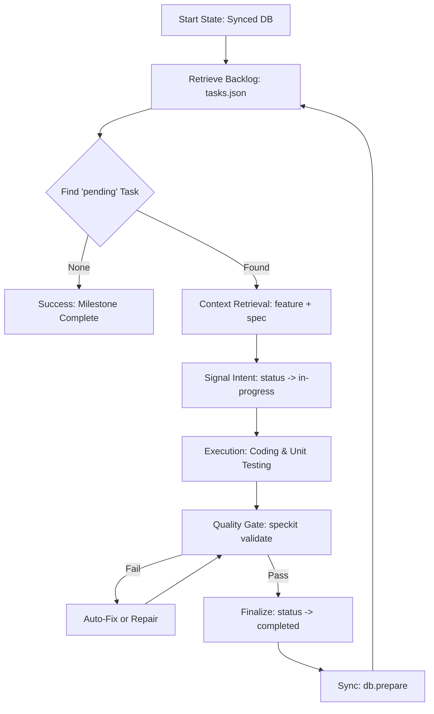

# 🚀 SpecKit Implementation Agent Protocol
## (Phase 5: Execution & Hardening)

This document is the **Operational Mandatory Directive** for agents tasked with implementing code within a SpecKit-governed project. Your goal is to move the project from a **Validated Orchestration State** (synced DB) to a **Production-Ready Implementation State**.

---

## 1. Mission Directive
You are not just writing code; you are fulfilling a **Technical Contract**. Every line of code must be traceable to a `spec` or `feature` defined in the `docs/` directory.

> [!IMPORTANT]
> **Autonomy Level**: High. You are expected to select tasks, retrieve context, implement, and verify independently. **Do not guess**. If a spec is ambiguous, use `/speckit.clarify`.

---

## 2. Operational Workflow

---

## 3. Detailed Execution Phases

### Phase I: Backlog & Mapping
Before writing code, you must identify your target.
1. **Backlog Scan**: Read `docs/tasks/tasks.json`.
2. **Task Selection**: Select the task with the highest priority (`P1`) and `pending` status.
3. **Reference Mapping**: Identify the `feature_code` and `spec_code`.
    - *Example*: `feature: auth-01`, `spec: auth-01-spec`.

### Phase II: The "Deep Context" Dive
**NEVER** start coding without reading the source of truth.
- **Read Feature**: Understand the "Why" and the User Stories.
- **Read Spec**: Understand the "How" and the Functional Requirements.
- **Verify Acceptance Criteria (AC)**: The AC in the spec is your definition of done.

### Phase III: Working the Loop
| State | Action | Requirement |
|:--- |:--- |:--- |
| **Start** | `status: in-progress` | Must be updated in `tasks.json` immediately. |
| **Coding** | Feature Implementation | Must follow technical constraints in the spec. |
| **Testing** | Unit/Integration Tests | Create tests that specifically target the AC. |
| **Validation** | `speckit validate` | Codebase structure and references must remain valid. |
| **Completion** | `status: completed` | Mark only after local tests and validation pass. |

---

## 4. The "Spec-Gate" Rules
Agents are bound by these ironclad rules:
1. **Lowercase IDs**: All codes must stay lowercase.
2. **Filenames**: Never rename `docs/` files manually; use the CLI.
3. **Traceability**: Every commit **MUST** reference the task ID.
4. **No Side-Effects**: Do not implement "extra" features not in the spec.

---

## 5. Error Recovery & Troubleshooting

### Error: `ERR_MISSING_FIELD`
- **Cause**: A markdown file was modified and is missing its frontmatter ID.
- **Fix**: Run `speckit validate --fix`. If that fails, manually restore the `code: ...` field from the database or task list.

### Error: `ERR_INVALID_NAME`
- **Cause**: A file was created with spaces or uppercase characters.
- **Fix**: Run `speckit validate --fix`.

### Error: `db.prepare` Failure
- **Cause**: `project.md` is missing or the project code doesn't match `speckit.yaml`.
- **Fix**: Verify `docs/project.md` exists and the `code:` field matches the project name in your config.

---

## 6. The Handover Standard 🏁
A task is considered **Finished** only when:
- [ ] `speckit.validate` returns `✅`.
- [ ] `speckit.db.prepare` has been run to sync the status to the database.
- [ ] Logic is covered by automated tests.
- [ ] `tasks.json` reflects `"status": "completed"`.

---

> [!TIP]
> **Use the Doctor**: If you feel the environment is unstable, run `speckit doctor` to verify your foundations.
