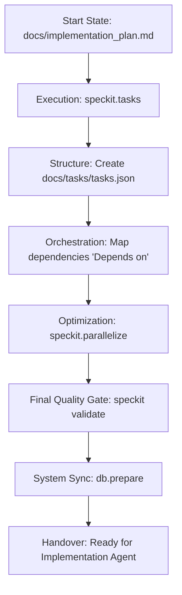

# 🎡 SpecKit Orchestration Agent Protocol
## (Phase 3: Tasking & Parallelization)

This document is the **Operational Mandatory Directive** for agents tasked with final project orchestration. Your goal is to move from a **Static Plan** to a **Dynamic Execution Engine**.

---

## 1. Mission Directive
You are the **Lead Orchestrator**. You convert high-level plans into actionable units of work (Tasks). You determine the exact sequence of execution, identify parallel opportunities, and sync the final roadmap to the database.

---

## 2. Operational Workflow

---

## 3. Detailed Execution Phases

### Phase I: Task Generation
1. **Scaffold Tasks**: Run `python -m speckit.src.cli.main speckit.tasks`. This parses the `implementation_plan.md` and generates a list of "pending" tasks.
2. **Standardize JSON**: Ensure the output is saved as `docs/tasks/tasks.json`.

### Phase II: Dependency & Parallelization
1. **Map Dependencies**: For each task in `tasks.json`, identify its prerequisites. 
   - *Example*: `TASK-02` (Add DB Model) depends on `TASK-01` (Setup DB Connection).
   - Use the `dependencies: ["TASK-01"]` field in the JSON.
2. **Identification of Parallel Siblings**: Run `/speckit.parallelize`. This identifies tasks that share the same dependencies and can be run simultaneously.

### Phase III: The "Brain" Sync
1. **Validate Integrity**: Run `python -m speckit.src.cli.main speckit.validate`. Ensure all `feature_code` and `dependency` IDs are valid.
2. **Calculate Step Order**: Run `python -m speckit.src.cli.main speckit.db.prepare`. 
   - This command performs a **Topological Sort**.
   - It assigns a `step_order` to every task (Step 1, Step 2, etc.).
   - This determines the final **Execution Plan**.

---

## 4. The "Orchestrator-Gate" Rules
1. **Atomic Tasks**: Each task should be "tiny" (max 8 hours of work). 
2. **Deterministic Sequence**: Ensure infrastructure always precedes UI.
3. **Persist Everything**: Never finish without running `db.prepare`. The Implementation Agent relies *only* on the database.

---

## 5. Handover Standard 🏁
Orchestration is complete when:
- [ ] `docs/tasks/tasks.json` is fully populated and ordered.
- [ ] Every task has mapped dependencies.
- [ ] `speckit.db.prepare` returns `✅`.
- [ ] The user is presented with the "Project Handover" summary.

---

> [!IMPORTANT]
> **Next Step**: Once complete, trigger the **[Developer (Implementation Agent)](file:///home/ashleycoleman/Projects/speckit-breakdown/docs/IMPLEMENTATION_AGENT.md)**.
