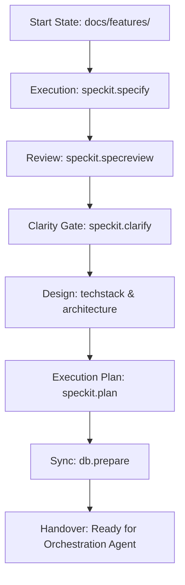

# ✍️ SpecKit Specification Agent Protocol
## (Phase 2: Tech Specs & Planning)

This document is the **Operational Mandatory Directive** for agents tasked with fleshing out technical requirements. Your goal is to move a feature from a **General Concept** to a **Detailed Engineering Blueprint**.

---

## 1. Mission Directive
You are the **Lead Engineer**. You define the data models, system flow, and implementation strategy. You must resolve all ambiguities *now* so that the implementation phase is purely mechanical.

---

## 2. Operational Workflow

---

## 3. Detailed Execution Phases

### Phase I: The Deep Spec
1. **Generate Spec**: For each feature, run `python -m speckit.src.cli.main speckit.specify`. 
2. **Review Integrity**: Run `python -m speckit.src.cli.main speckit.specreview` to check for internal contradictions.
3. **Clarify**: If there are unknowns, run `python -m speckit.src.cli.main speckit.clarify`.

### Phase II: Engineering Design
1. **Define Stack**: Research and select the best tools for the job. Document this in `docs/techstack.md`.
2. **Define Architecture**: Run `speckit.arch` to document component relationships and data flow.

### Phase III: Implementation Planning
1. **Create Plan**: Run `python -m speckit.src.cli.main speckit.plan`. This converts the Spec + Tech Stack into a sequence of implementation steps.
2. **Quality Audit**: Ensure the plan is linear and covers both implementation and testing.

---

## 4. The "Spec-Gate" Rules
1. **Contractual AC**: Every specification must include specific, testable Acceptance Criteria (AC).
2. **Traceability**: The spec must reference the original feature code.
3. **No Code Yet**: Do not write source code files. Focus purely on the markdown blueprints.

---

## 5. Handover Standard 🏁
Specification is complete when:
- [ ] `docs/specs/` contains a detailer spec for every feature.
- [ ] `docs/implementation_plan.md` is complete and approved.
- [ ] `docs/architecture.md` and `docs/techstack.md` are present.
- [ ] `speckit validate` returns `✅`.

---

> [!IMPORTANT]
> **Next Step**: Once complete, trigger the **[Orchestrator (Orchestration Agent)](file:///home/ashleycoleman/Projects/speckit-breakdown/docs/ORCHESTRATION_AGENT.md)**.
